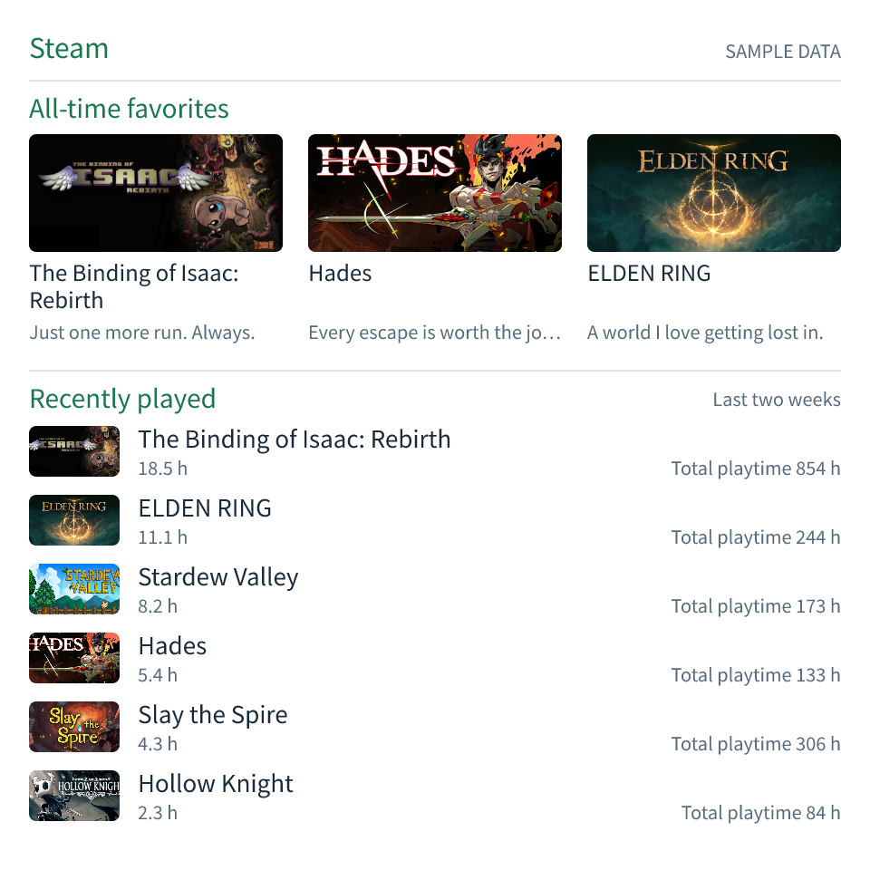

# Steam Stats

Your favorite games, recent adventures, and most-played titles — in one card for
your GitHub README. Choose your favorites yourself; hours do not get the final say.

[中文说明](docs/README.zh-CN.md) · [Configuration](docs/configuration.md) · [Technical notes](docs/technical-notes.md)

<picture>
  <source media="(prefers-color-scheme: dark)" srcset="docs/previews/dark-en.png">
  
</picture>

*Fictional profile and statistics. Cover art is from Steam and belongs to the
respective rights holders. This project is not affiliated with Valve.*

## What it does

- One compact 480-pixel-wide PNG card, rendered at 2× resolution for crisp README display.
- Designed for a profile README column; no update timestamp or source footer.
- Three-column favorites with optional short notes (3 by default).
- Default layout is 480 × 480 logical pixels with 3 favorites and 6 recent games.
- Recent activity ranked by two-week playtime (6 by default).
- Optional all-time playtime ranking (off by default, 3 when enabled).
- Optional library size, total playtime and two-week playtime overview (off by default).
- English / Simplified Chinese; dark / light themes; per-section switches.
- Duplicate games across sections are intentional. Automatic lists can exclude games.
- Failed data requests preserve the previous card. Missing artwork uses a placeholder.
- Runs locally or in your own GitHub Actions workflow. No hosted service to maintain.

## Try it without an API key

Use Node.js 22 or 24 and pnpm 11.1.2, then run in this repository:

```sh
pnpm install --frozen-lockfile --ignore-scripts
pnpm run demo
```

Open `generated/steam-card.png`. Demo mode is offline, uses fictional statistics,
and is visibly labeled. To use public game covers with those sample statistics:

```sh
pnpm run demo --online-art
```

## Generate your own card

1. Copy `config.example.yml` to `config.local.yml`.
2. Set your quoted 17-digit SteamID64 and edit the favorite App IDs / notes.
3. Make your Steam **Game details** public. Disable **Always keep my total playtime
   private** if displaying playtime. Enable only the sections you want to publish.
4. Obtain your own [Steam Web API key](https://steamcommunity.com/dev/apikey) and
   provide it through the `STEAM_API_KEY` environment variable. Never commit it.
5. Generate:

```sh
pnpm run generate --config config.local.yml --output generated/steam-card.png
```

Your local configuration is ignored by Git. For GitHub Actions, commit a public
copy named `steam-stats.yml` with your display preferences, and store the API key
in an Actions secret named `STEAM_API_KEY`.

## Update a GitHub README automatically

**Publishing status:** the action is implemented in this repository but has not
yet been published to a remote repository or Marketplace. The example deliberately
uses `OWNER/steam-stats@COMMIT_SHA`; replace it with the actual repository and a
reviewed commit after publication. There is no released `v1` tag yet.

1. In your profile repository, add your configuration as `steam-stats.yml`.
2. Add the repository secret `STEAM_API_KEY`.
3. Copy [examples/update-card.yml](examples/update-card.yml) to
   `.github/workflows/steam-stats.yml`, and replace the action reference.
4. The example updates `assets/steam-card.png` daily at **04:23 UTC** and can be
   run manually. It grants `contents: write` only for committing the card.
5. Add this to your README, replacing the profile ID:

```html
<a href="https://steamcommunity.com/profiles/YOUR_STEAM_ID/">
  
</a>
```

The action generates only the PNG; the example workflow handles committing it.
Protected branches may require a PR-based publishing workflow. A concurrent branch
update can reject the push; the example never force-pushes or rewrites history.
GitHub schedules can be delayed and public-repository schedules may be disabled
after inactivity. Images may remain cached briefly after an update.

## Options

```sh
pnpm run generate --help
pnpm run generate --config config.local.yml --no-art
pnpm run demo:all --online-art
```

The complete schema and defaults are in [docs/configuration.md](docs/configuration.md).
Light and Chinese examples are in [docs/previews](docs/previews).
Run `pnpm run preview` to view the gallery locally. A PNG supports a single link
around the whole card; individual games inside the image are not clickable.

## Development

```sh
pnpm install --frozen-lockfile --ignore-scripts
pnpm run verify
pnpm run demo
```

Tests use isolated temporary files and mocked HTTP; no Steam account or credentials
are required. After building, run the CLI as `node dist/src/cli.js`.

The implementation separates configuration, Steam transport, the card model,
artwork, typography, rendering and atomic output. No system font installation or
browser is needed to generate a card. CI definitions cover Windows / Ubuntu on
Node.js 22 / 24 and a separate composite-action smoke test.

## Data and attribution

Only request statistics for your own account or an account whose owner asked you
to display them. This tool sends requests directly to Steam; it has no telemetry
or central server. Steam IDs and configuration stay in the file you choose;
profile data is held in process memory. Downloaded artwork is cached locally;
in Actions it uses the runner temporary directory. The PNG exposes the selected
profile information, games, notes and statistics. Committing it to a public
repository also puts previous card versions into Git history. Your machine or
chosen GitHub runner determines where processing occurs.

Steam data is provided as-is and may be incomplete or unavailable. Game-library
counts cover the games returned by Steam, including played free games, and may
differ from the Steam client's counts. Total hours sum reported lifetime minutes;
they are not unique wall-clock hours. See the [Steam Web API terms](https://steamcommunity.com/dev/apiterms)
and the [technical notes](docs/technical-notes.md) for limitations.

Source code is MIT licensed. The bundled Noto font is licensed under the SIL OFL;
game artwork and Steam data are not covered by the project's MIT license.

## Transparent background and theme switching

PNG backgrounds are transparent. The `theme` setting controls text and divider colors;
transparency alone does not change text colors. For automatic theme selection, generate
two images using the same configuration with `theme: dark` and `theme: light` respectively.
Keep the other configuration fields identical. For example:

```sh
pnpm run generate --config steam-stats-dark.yml --output assets/steam-dark.png
pnpm run generate --config steam-stats-light.yml --output assets/steam-light.png
```

Then embed them in the profile README:

```html
<a href="https://steamcommunity.com/profiles/YOUR_STEAM_ID/">
  <picture>
    <source media="(prefers-color-scheme: dark)" srcset="assets/steam-dark.png">
    
  </picture>
</a>
```

In Actions, invoke the card action once for each configuration/output pair and commit
both output paths. The existing single-image workflow remains a single-theme example.
