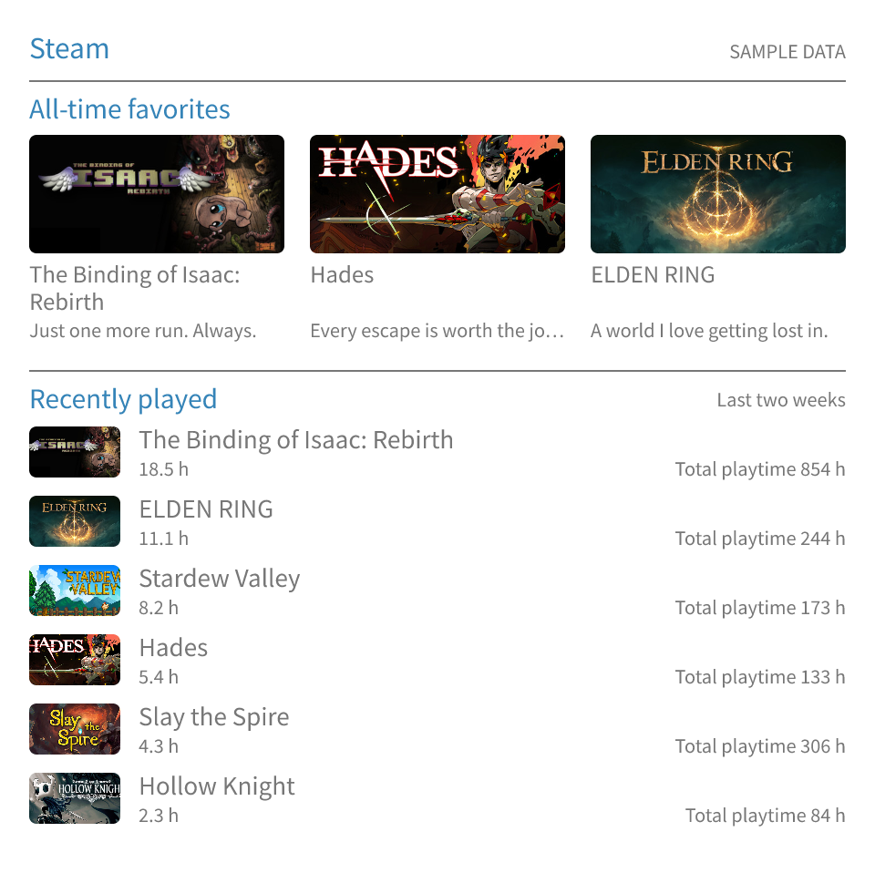

# Game Shelf Card

在 GitHub README 展示一张游戏卡片：自选最爱、最近在玩，以及可选的累计时长排行。
支持 Steam、IGDB 和手动添加的游戏。

[English](../README.md) · [配置参考](configuration.md) · [跨平台游戏](cross-platform.md)



## 放到 GitHub 主页

1. 将 [config.example.yml](../config.example.yml) 复制到 profile 仓库，命名为
   `steam-stats.yml`。填写带引号的 17 位 SteamID64，以及最爱游戏的 ID（Steam 商店链接中的数字）。
2. 将 Steam「游戏详情」设为公开，并允许显示游玩时长。
   获取 [Steam Web API key](https://steamcommunity.com/dev/apikey)，在仓库
   **Settings → Secrets and variables → Actions** 中添加 `STEAM_API_KEY`。
3. 添加简短的[工作流引用](../examples/update-card.yml)，保存为
   `.github/workflows/steam-stats.yml`，把两个文件提交到默认分支。
   打开 **Actions → Update Steam card → Run workflow** 生成卡片。
4. 在 README 添加图片，把链接改成自己的 Steam 主页或游戏介绍页：

```html
<a href="https://steamcommunity.com/profiles/YOUR_STEAM_ID/">
  
</a>
```

调用文件负责定时触发，共享工作流负责生成和提交图片。示例使用单张透明图片，文字配色兼顾深浅背景。

## 调整内容

在配置中修改最爱和最近在玩的数量、添加短评、开启累计时长排行。
设置 `language: zh-CN` 使用中文，设置 `min_height` 与旁边的卡片对齐。
卡片宽度为 480 像素，高度随内容增长。

全部选项见[配置参考](configuration.md)；IGDB、手动封面和游戏名翻译见[跨平台游戏](cross-platform.md)。

## 本地运行

安装 Node.js 22 或 24、pnpm 11.1.2：

```sh
git clone https://github.com/mcthesw/game-shelf-card.git
cd game-shelf-card
pnpm install --frozen-lockfile --ignore-scripts
pnpm run demo
```

打开 `generated/steam-card.png` 查看示例。使用自己的账号时，将 `config.example.yml`
复制为 `config.local.yml`，填写 Steam ID，设置环境变量 `STEAM_API_KEY`，然后执行：

```sh
pnpm run generate --config config.local.yml --output generated/steam-card.png
```

开发检查：`pnpm run verify`（类型检查、测试和构建）。

## 许可

代码采用 [MIT](../LICENSE)，[Noto 字体](../assets/fonts/README.md)采用 SIL OFL。
游戏图片版权归各权利人所有，预览中的统计为示例数据。
