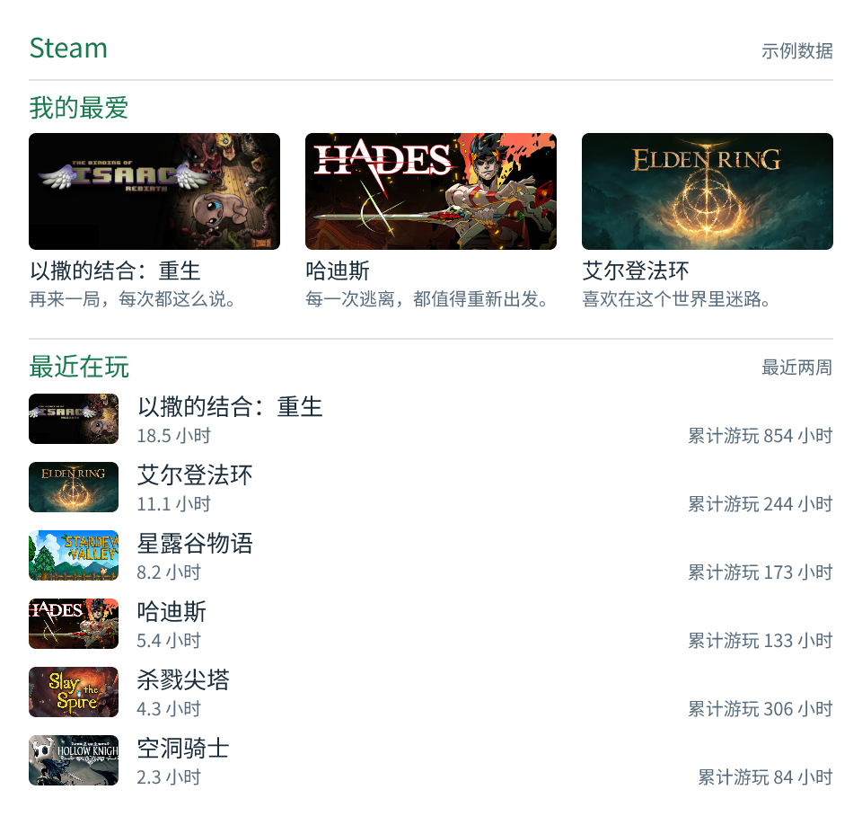

# Steam Stats

在 GitHub README 展示自己的 Steam 游戏时光：最爱由自己挑选，最近在玩和
累计时长排行自动生成。首版生成一张完整 PNG，支持中英文、深浅主题。

<picture>
  <source media="(prefers-color-scheme: dark)" srcset="previews/dark-zh-CN.png">
  
</picture>

上图是虚构统计，封面来自 Steam；不是你的真实账号数据。

## 本地体验

安装 Node.js 22 或 24，在仓库执行：

```sh
pnpm install --frozen-lockfile --ignore-scripts
pnpm run demo
```

打开 `generated/steam-card.png`。默认示例完全离线；加上
`pnpm run demo --online-art` 可以下载 Steam 公开封面。

## 使用自己的账号

1. 将 `config.example.yml` 复制为 `config.local.yml`。
2. 填写带引号的 17 位 SteamID64，调整最爱 App ID 和短评。
3. Steam「游戏详情」需设为公开；展示时长时关闭「始终将我的总游戏时间保密」。
4. 从 [Steam](https://steamcommunity.com/dev/apikey) 获取自己的 Web API key，
   通过环境变量 `STEAM_API_KEY` 传入，避免把凭据写进配置或 Git。
5. 执行：

```sh
pnpm run generate --config config.local.yml --output generated/steam-card.png
```

默认最爱 3 款横排、最近在玩 6 款纵排，完整样稿为 480×480。
总览和累计排行默认关闭；累计排行开启后默认 3 款，各区域可调整数量。
最爱支持短评；`name` 可覆盖已下架游戏的标题。排除列表只影响自动排行，
不改变最爱或总览统计。跨区域允许重复游戏。

## GitHub 自动更新

仓库已包含 composite action 和每日更新 workflow 示例，但尚未发布到远程
仓库。发布后把 `examples/update-card.yml` 的 `OWNER/steam-stats@COMMIT_SHA`
替换为实际仓库和审阅过的提交。不要引用尚不存在的 `v1`。

在个人主页仓库：

- 提交 `steam-stats.yml`，添加 Actions Secret `STEAM_API_KEY`。
- 将 workflow 示例复制到 `.github/workflows/steam-stats.yml`。
- 默认每天 04:23 UTC（北京时间 12:23）更新，也可手动运行。
- 在 README 中引用 `assets/steam-card.png`，并链接自己的 Steam 主页。

```html
<a href="https://steamcommunity.com/profiles/YOUR_STEAM_ID/">
  
</a>
```

数据请求失败时保留旧卡；缺少封面时使用缓存或占位图。私密资料或缺失时长
不会被当作零数据。图片更新存在 GitHub 调度、缓存延迟；公开仓库图片的
历史版本也会留在 Git 历史中。请只展示本人或已授权的账号。

首版总览统计为 Steam 接口返回的游戏数量、累计分钟之和和最近两周分钟之和，
不承诺与客户端所有统计口径一致。全成就游戏数尚未实现。

完整配置见 [configuration.md](configuration.md)，技术证据和限制见
[technical-notes.md](technical-notes.md)。源码为 MIT 许可，字体遵循 SIL OFL，
游戏图片权利归各自权利人所有。本项目与 Valve 无隶属关系。

卡片按 480 像素宽的 README 栏位设计，PNG 为两倍分辨率；不显示更新时间或数据来源页脚。项目统一使用 pnpm 11.1.2。

## 透明背景与主题切换

PNG 背景为透明，`theme` 决定文字和分隔线的颜色。仅透明不能让文字自动变色。
为自动适配主题，准备内容相同、仅 `theme: dark` / `theme: light` 不同的两份配置：

```sh
pnpm run generate --config steam-stats-dark.yml --output assets/steam-dark.png
pnpm run generate --config steam-stats-light.yml --output assets/steam-light.png
```

在 README 中组合两张图片：

```html
<a href="https://steamcommunity.com/profiles/YOUR_STEAM_ID/">
  <picture>
    <source media="(prefers-color-scheme: dark)" srcset="assets/steam-dark.png">
    
  </picture>
</a>
```

Actions 中对两份配置和对应输出各执行一次卡片 Action，并同时提交两个图片路径。
现有每日更新 workflow 仍为单图示例，需要按此方式扩展才能自动更新双主题图片。

最爱现支持 Steam、IGDB 和手动条目；配置、搜索命令和六款游戏样稿见 [跨平台使用说明](cross-platform.md)。
